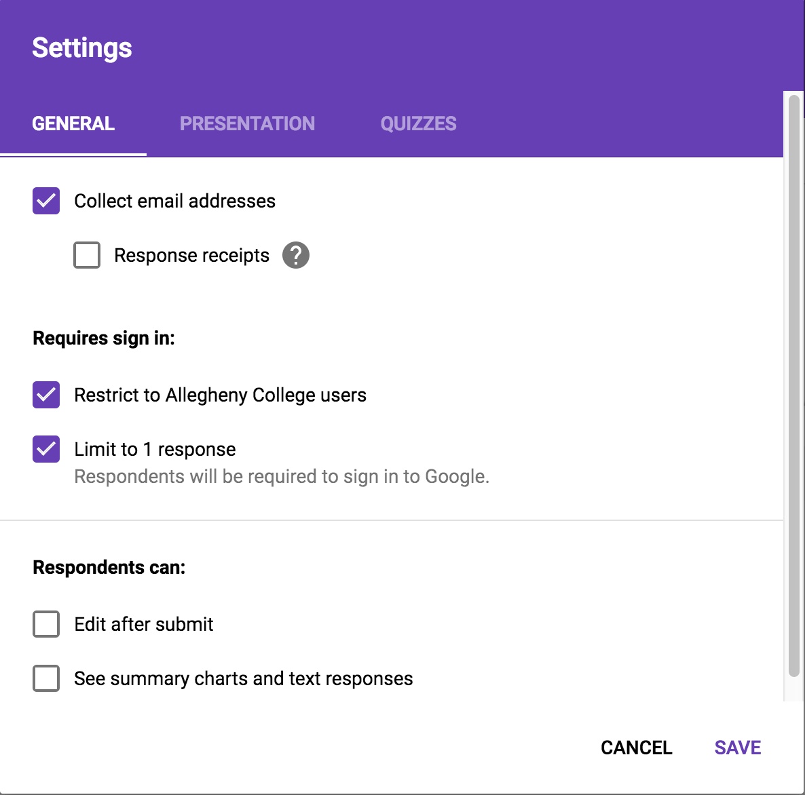

# GatorGrouper

GatorGrouper is a Python program that creates student groups based on preferences and skills, which are evaluated through a Google Form. It uses a genetic algorithm to generate groups that have three properties:

- **Preferences**. Groups respect preferences. If Student A indicates on the Google Form that they would like to work with Student B, then Student A and Student B should, if at all possible, end up in the same group. If both Student A and Student B list each other as preferences, they should have an even greater chance of ending up in the same group.
- **Skill balance**. Each group has approximately equal overall levels of all skills. For example, assume Student A and Student B end up in the same group. The group would not be balanced if both students were high in the same skill, but both low in the other skill required for the assignment. This group would be more balanced if Student A was high in the first skill and low in the second skill and Student B was low in the first skill and high in the second.
- **Skill fairness**. All groups should be about equal in each skill. Two groups would be fair if both groups had approximate overall scores of 3 in the first skill and approximate overall scores of 4 in the second skill.

## Configuration

Before running GatorGrouper, you will need to create a Google Form to collect the feedback from students. In the settings, check the **Collect email addresses** and **Limit to 1 response** options. If you are using an organizational email (e.g. Allegheny College email) to create this Google Form, you may also want to select the **Restrict to <ORGANIZATION NAME> users** option. This will mean that the emails of all respondents to the survey will follow the format *\<EMAIL>@\<ORGANIZATION SUFFIX>* (e.g. studenta@allegheny.edu), which will help students to list the correct emails of their preferences.



As described above, GatorGrouper supports two types of questions: preferences and skill.

The preferences question should ask students to list the emails of other students they want in their groups. Responses to this question must comply to these rules:
- Emails in the list must match the emails that preferences are using to submit the Google Form. For example, if Student A wants to list Student B as a preference, they must list the email Student B is using to submit the Google Form (e.g. studentb@allegheny.edu).
- The list must be comma-separated.
- The number of preferences must depend on group sizes. For example, if the group size is 2, students should only list one preference. If they list more, only the first preference will be considered. (To be general, the number of preferences should be one less than the group size, and and only the preferences that come first in the list up to the number limit will be considered).

You can word this question in any way, as long as it contains the keyword `prefer`. However, you will want to mention these rules in your question. Set the type of the question to **Short answer**. An example preferences question is provided below.


Skill questions should ask students to rate their ability in pertinent skills. Customize these questions based on what is required by the work for which you are creating these groups.  In your Google Form, set the type of these questions to "Linear scale". The range of the scale (e.g. **1 to 5**, **1 to 3**, etc.) or labels (e.g. 1 = "Beginner", 5 = "Expert", etc.) do not matter. You may have as many skill questions as you would like. You can word your skill questions in any way, as long as they contain the keyword `skill`. An example skill question is provided below.


After you have created your preferences and skill questions, go to the **Responses** tab and click on the green Google Sheet icon on the right-hand side.


Select the **Create a new spreadsheet** option. You can choose to leave the name of the spreadsheet as the default (i.e. the name of the Google Form) or change the name to your liking. Then, click the **Create** button.


After setting up the Google Form, please follow this [tutorial](https://www.twilio.com/blog/2017/02/an-easy-way-to-read-and-write-to-a-google-spreadsheet-in-python.html) to create a service account with the email you used to create the Google Form. In addition to enabling the Google Drive API, also enable the Google Sheets API.

Once you have generated your `client_secret.json` file, place it in the GatorGrouper root directory. It has been added to the `.gitignore` and should never be pushed to the repository. As the tutorial states, make sure to share the spreadsheet you created from your Google Form with the `client_email` in `client_secret.json`. This setup should take no longer than 5 minutes.

## Set-up

GatorGrouper requires Python 3. After installing Python 3 (and `pip`, the Python package manager), install dependencies by running the command:

```shell
pip install -r requirements.txt
```

Within `config.py`, set the `WORKBOOK` variable equal to the name of the spreadsheet you created from the Google Form. Here, you may also change the default group size, though group size can always be defined as a command-line argument.

## Usage

Before running GatorGrouper, students should fill out the Google Form you created.

GatorGrouper can be run without command-line arguments with:

```shell
python gatorgrouper.py
```

This will run GatorGrouper with the default group size listed in `config.py`. To specify a group size, run GatorGrouper with the `--group-size` flag followed by a number.

```shell
python3 gatorgrouper.py --group-size 3
```

### Logging

To see detailed general output to monitor progress, use the flag `-v` or
`--verbose`.

```shell
python gatorgrouper.py --verbose
```

To see detailed technical output to diagnose problems, use the flag `-d` or
`--debug`.

```shell
python gatorgrouper.py --debug
```

## Troubleshooting

If you encounter any problems with GatorGrouper, first make sure that:

- You have shared the spreadsheet with the `client_email` in your `client_secret.json`.
- You have updated the `WORKBOOK` variable in `config.py` correctly.

If doing these things does not resolve your problem, we would greatly appreciate if you would take the time to submit an issue.

[](https://coveralls.io/github/GatorGrouper/gatorgrouper?branch=master)
